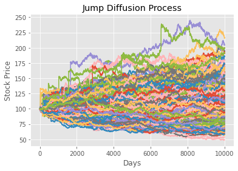

#  Black-Scholes Options Pricing Calculator 


## Project Description

This project is an Options Pricing Calculator for European Options including graphical visualization. We aim to better understand the Black Scholes Model but also to compare with Monte Carlo Simulation Methods.

## Black-Scholes Model Assumptions

The Black-Scholes model makes certain assumptions:

- No dividends are paid out during the life of the option.
- Markets are random (i.e., market movements cannot be predicted).
- There are no transaction costs in buying the option.
- The risk-free rate and volatility of the underlying asset are known and constant.
- The returns on the underlying asset are log-normally distributed.
- The option is European and can only be exercised at expiration.

## Black-Scholes Solving

Under theses assumptions we have closed formulas for call option and put option at any time t


with : 


```python
import numpy as np
from scipy.stats import norm

def black_scholes(S, K, r, sigma, T):
    d1 = (np.log(S/K) + (r + 0.5 * sigma**2) * T) / (sigma * np.sqrt(T))
    d2 = d1 - sigma * np.sqrt(T)

    call_price = S * norm.cdf(d1) - K * np.exp(-r * T) * norm.cdf(d2)
    put_price = K * np.exp(-r * T) * norm.cdf(-d2) - S * norm.cdf(-d1)

    return call_price, put_price

# Exemple d'utilisation
S = 116.75  # Prix de l'actif sous-jacent
K = 150  # Prix d'exercice de l'option
r = 0.05  # Taux d'intérêt sans risque
sigma = 0.3173 # Volatilité du sous-jacent
T = 1 # Temps jusqu'à l'expiration de l'option en année

call_price, put_price = black_scholes(S, K, r, sigma, T)
print("Prix de l'option d'achat :", call_price)
print("Prix de l'option de vente :", put_price)
```

    Prix de l'option d'achat : 6.50798535508606
    Prix de l'option de vente : 32.442399030193144


The implementation is quite easy beacause we have closed formulas thanks to the CDF of the Normal Law.

## Questioning the model

However, the log-normally distributed assumption can be challenged. In fact, this assumption does not take in account "jumps" that occurs in the market. It could be :
- negative jumps (bad result, crash, covid...)
- positive jumps (good result, good news for the inverstors..)

We'll try to incorporate these jumps that could occur with a small probability by using a Poisson Law. The issue is that we do not have closed formulas any more because we do not respect one of the assumption. What we are going to do is to use a Monte Carlo Simulation for pricing the option because we can then compute a statistic estimator of the expected payoff that we will actualize to the risk free rate.

Call Price : $$ \mathbb{E}\left ( \mathit{\text{payoff}} \right ) \times e^{-rT}$$


```python
import matplotlib.pyplot as plt
plt.style.use('ggplot')

def merton_jump_paths(S, T, r, sigma,  lam, m, v, steps, Npaths):
    size=(steps,Npaths)
    dt = T/steps 
    poi_rv = np.multiply(np.random.poisson( lam*dt, size=size),
                         np.random.normal(m,v, size=size)).cumsum(axis=0)
    geo = np.cumsum(((r -  sigma**2/2 -lam*(m  + v**2*0.5))*dt +\
                              sigma*np.sqrt(dt) *\
                              np.random.normal(size=size)), axis=0)
    
    return np.exp(geo+poi_rv)*S


S = 100 # current stock price
T = 1 # time to maturity
r = 0.05 # risk free rate
m = 0.05 # meean of jump size
v = 0.1 # standard deviation of jump
lam =1 # intensity of jump i.e. number of jumps per annum
steps =10000 # time steps
Npaths = 1000 # number of paths to simulate
sigma = 0.2 # annual standard deviation , for weiner process
K =100 #striking price

j = merton_jump_paths(S, T, r, sigma, lam, m, v, steps, Npaths) #generate jump diffusion paths

plt.plot(j)
plt.xlabel('Days')
plt.ylabel('Stock Price')
plt.title('Jump Diffusion Process')
plt.show()


#j[-1] = S_T
mcprice = np.maximum(j[-1]-K,0).mean() * np.exp(-r*T) # calculate value of call : E(rend)exp(-rT)
call_price, put_price = black_scholes(S, K, r, sigma, T)
print("Prix de l'option d'achat Black Scholes :", call_price)
print('Monte Carlo Merton Price =', mcprice)
```





    Prix de l'option d'achat Black Scholes : 10.450583572185565
    Monte Carlo Merton Price = 11.061857037688974


### Observations

The pros of this changement :
- Simulating extreme events in the asset price
- Find a computed price closer of what we found on the market

The cons :
- Complexity (very slow convergence due to Monte Carlo)
- Only a formula to compute the premium at t=0
- Need to find the optimal parameter for our Poisson Processus


```python

```
